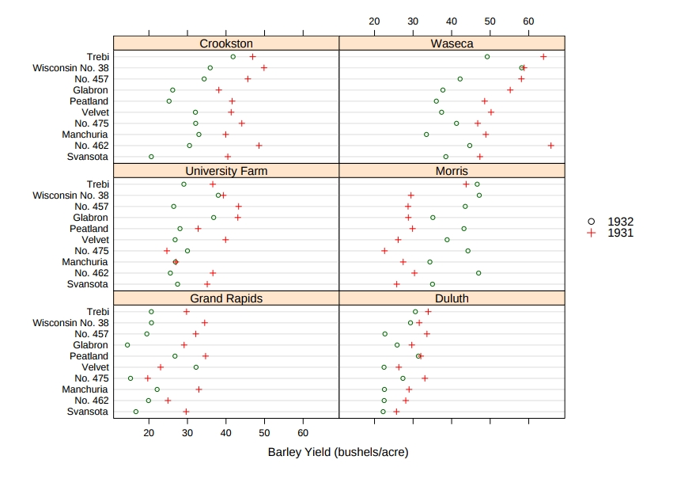

# Work on Trellis Graphs
## Historical examples

Trellis Graphics is a family of techniques for viewing complex, multi-variable data sets. The ideas have been around for a while, but were formalized by researchers at Bell Laboratories during the 1990s.
The techniques were given the name Trellis because they usually result in a rectangular array of plots,resembling a garden trellis.

Trellis plots are based on the idea of conditioning on the
values taken on by one or more of the variables in a data
set: 
- Categorical variables: Same plot for the data subsets corresponding to
each of the levels of that variable
- Numeric variables: Same plot the data subsets corresponding to intervals of
that variable.

Furthermore, they is a variety of displays which can be produced by Trellis:
– Bar Charts
– Dot Charts
– Box and Whisker Plots
– Histograms
– Density Traces
– QQ Plots
– Scatter Plots
Therefore they are extremely adaptable, which in term makes it a suitable visualization for a vast range of data.
Examples:

<table border="0">
  <tr>
    <td>
      
    </td>
  </tr>
</table>

- The plot is read left-to-right and bottom-to-top.
- Depth increases progressively through the plot.
- There are eight different depth intervals, each containing
approximately the same number of earthquakes.
- Consecutive depth intervals overlap by a small amount.
- The range of depths covered by each interval is
indicated in the bar above each plot.

<table border="0">
  <tr>
    <td>
      
    </td>
  </tr>
</table>

This example illustrates the yields obtained from field trials of barley seed. In total it displayes 
120 observations over an period of 2 years. Because of the superimposion of the 2 years for multiple strains. 
The advatange of multiple information. It gives a straight foward overview on the evolution and for different experiments in a way that allows one to determine first correlations.
<table border="0">
  <tr>
    <td>
      
    </td>
    <td>
      <a href="http://www.personal.reading.ac.uk/~sns97aal/MTBprofile.jpg">File:GanttChartAnatomy.png</a> by Sandro Leidi
    </td>
  </tr>
</table>

This trellis plot is a scatter plot of the evolution of the soil over the years. It statistically summarises the amount of soil erosion over time. In this case it can be used as a quick decision making tool at the exploratory stage. Nevertheless, the plot could have been made more effecive in terms of colouring and accessibility. A first look doesn't allow one to extract the important information. 

<table border="0">
  <tr>
    <td>
      
    </td>
    <td>
       Replicate altitudinal clines reveal evolutionary flexibility underlies adaptation to drought stress in annual Mimulus guttatus    </td>
  </tr>
</table>

Trellis plot depicting relationships between morphological, dehydration avoidance and drought escape traits. Scatterplots below diagonal are bivariate means for each Mimulus guttatus line. Plots along the diagonal are histograms for line means for each trait. Numbers above diagonal are Pearson correlation coefficients for each trait–trait association. Red values indicate statistically significant correlations. Asterisks are used to depict P-values associated with each bivariate correlation:

In this case the trellis plot was used to its fullest potential, because one is able to actually distract a lot of information from one plot. At the same time, a first look already gives you an idication on the most important aspects of the research. Furthermore, the highlighting of the most significant correlations immediatly catches your eyes.

<table border="0">
  <tr>
    <td>
      
    </td>
    <td>
        From Ground Motion Prediction Equations    </td>
  </tr>
</table>

The Plot shows a multitude of information concerning the evolution of an earthquake. Therefore, it highlights different sights with different coulours, but except of the general tendency the superposition of the graphs doesn't allow for the extraction of more detailled information. A possibility could be to superimpose less graphs or introduce different shapes to make them more distinguishable. Furthermore, insteqd of a graph a boxplot could have been more usefull.

<table border="0">
  <tr>
    <td>
      
    </td>
    <td>
        From Python tutorial for trellis plots</td>
  </tr>
</table>

The plot is a statistical summary about the amount of tips depending on multiple factors. The usage of kernels is a good way in this case to superimpose multiple data, because it allows the addition of scatterplots and in an effective manner. However, one should add a legend, because it is not clear what all the attributs are.  

The presented plots illustrate the general issue of this kind of data visualization. There is a critical mass of data to superimpose in the same plot, because despite containing a lot of information their distraction is not intuitive. From an initial view the reader can't understand or use the plot effectively 

## Ressources
https://www.stat.auckland.ac.nz/~ihaka/787/lectures-trellis.pdf
http://www.personal.reading.ac.uk/~sns97aal/MTBtrellis.html
https://www.researchgate.net/figure/Trellis-plot-depicting-relationships-between-morphological-dehydration-avoidance-and_268452555
https://storage.globalquakemodel.org/what/seismic-hazard/gmpes/
http://pandas.pydata.org/pandas-docs/version/0.14/rplot.html
